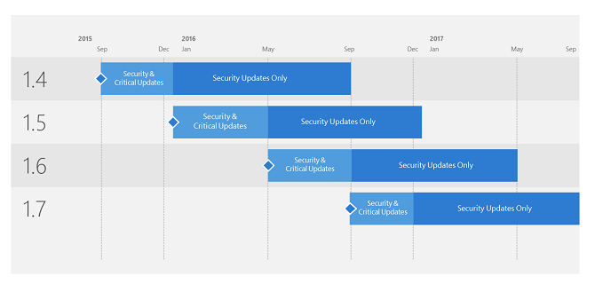

*적용 대상: Advanced Threat Analytics 버전 1.8*

# Microsoft ATA(Advanced Threat Analytics)에 대한 지원

Microsoft는 GA(일반 공급) 릴리스 날짜로부터 12개월 동안 지원되는 각 업데이트 버전과 함께 연간 몇 차례 ATA 업데이트를 릴리스할 계획입니다. 전체 12개월 동안 기술 지원이 제공됩니다. 그러나 당사의 지원 구조는 최신 버전의 가용성에 따라 두 가지 별도의 서비스 단계로 발전하는 동적 구조입니다.

-   보안 및 중요 업데이트 서비스 단계 - 최신 ATA 버전을 실행하는 경우 보안 및 중요 업데이트를 모두 받게 됩니다.

-   보안 업데이트(만) 서비스 단계 - 12개월 동안 새 ATA 버전이 릴리스되면 그 나머지 기간(아래 지원 서비스 버전 예제 참조) 동안만 이전 버전에 대한 지원이 보안 업데이트만으로 줄어듭니다.
 

> [!Note]
> 최신 ATA 버전은 항상 보안 및 중요 업데이트 서비스 단계입니다. 즉, 중요 업데이트가 필요한 코드 오류가 발생하는 경우 이를 해결하려면 최신 현재 분기 버전을 설치해야 합니다. 지원되는 다른 모든 버전은 보안 업데이트만 받을 수 있습니다. 버전에 대한 12개월의 지원 기간이 만료되면 모든 지원이 종료됩니다. 이 시점에서 고객은 지원되는 버전으로 업데이트해야 합니다.

## 버전 기록

|버전|빌드 번호|가용일| 지원 종료 날짜|
|----|----|----|----|
|1.4|1.4.2457|2015년 8월 31일|2016년 8월 30일|
|1.5|1.5.2946|2015년 12월 17일|2016년 12월 16일|
|1.6|1.6.4103|2016년 5월 05일|2017년 5월 04일|
|1.6.1|1.6.4317|2016년 6월 15일|2017년 6월 14일|
|1.7|1.7.5402|2016년 8월 31일|2017년 8월 30일|
|1.7.1|1.7.5647|2016년 10월 06일|2017년 10월 05일|
|1.7.2|1.7.5757|2016년 11월 15일|2017년 11월 14일|

## 참고 항목

[ATA 포럼을 확인해 보세요!](https://social.technet.microsoft.com/Forums/security/home?forum=mata)
