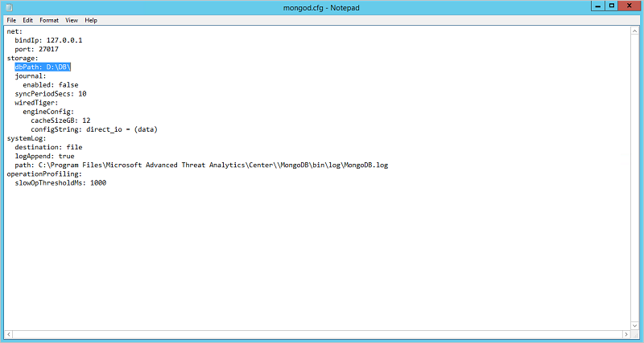

# ATA 데이터베이스 관리
ATA 데이터베이스를 이동, 백업 또는 복원해야 하는 경우에는 아래에 나와 있는 MongoDB 사용 절차를 수행하세요.

## ATA 데이터베이스 백업
[관련 MongoDB 설명서](http://docs.mongodb.org/manual/administration/backup/)를 참조하세요.

## ATA 데이터베이스 복원
[관련 MongoDB 설명서](http://docs.mongodb.org/manual/administration/backup/)를 참조하세요.

## 다른 드라이브로 ATA 데이터베이스 이동

1.  **Microsoft Advanced Threat Analytics 센터** 서비스를 중지합니다.

2.  **MongoDB** 서비스를 중지합니다.

3.  Mongo 구성 파일(기본 위치: C:\Program Files\Microsoft Advanced Threat Analytics\Center\MongoDB\bin\mongod.cfg)을 엽니다.

    매개 변수 찾기 `storage: dbPath`

4.  `dbPath` 매개 변수에 나와 있는 폴더를 새 위치로 이동합니다.

5.  Mongo 구성 파일 내의 `dbPath` 매개 변수를 새 폴더 경로로 변경하고 파일을 저장한 후에 닫습니다.

    

6.  **MongoDB** 서비스를 시작합니다.

7.  명령 프롬프트를 열고 `mongo.exe ATA`를 실행하여 Mongo 셸을 실행합니다.

    mongo.exe의 기본 위치는 C:\Program Files\Microsoft Advanced Threat Analytics\Center\MongoDB\bin입니다.

8.  다음 명령을 실행합니다. `db.SystemProfiles.update( {_t: "CenterSystemProfile"} , {$set:{"Configuration.CenterDatabaseClientConfiguration.DataPath" : "<New DB Location>"}})`

   여기서 `&lt;New DB Location&gt;`는 <New DB Location> 대신 새 폴더 경로입니다.

9.  HKEY_LOCAL_MACHINE\SOFTWARE\Microsoft\Microsoft Advanced Threat Analytics\Center\DatabaseDataPath를 새 폴더 경로로 업데이트합니다.

9. **Microsoft Advanced Threat Analytics 센터** 서비스를 시작합니다.

## 참고 항목
- [ATA 아키텍처](/advanced-threat-analytics/plan-design/ata-architecture)
- [ATA 필수 구성 요소](/advanced-threat-analytics/plan-design/ata-prerequisites)
- [ATA 포럼을 확인해 보세요!](https://social.technet.microsoft.com/Forums/security/home?forum=mata)

<!--HONumber=Jul16_HO3-->

