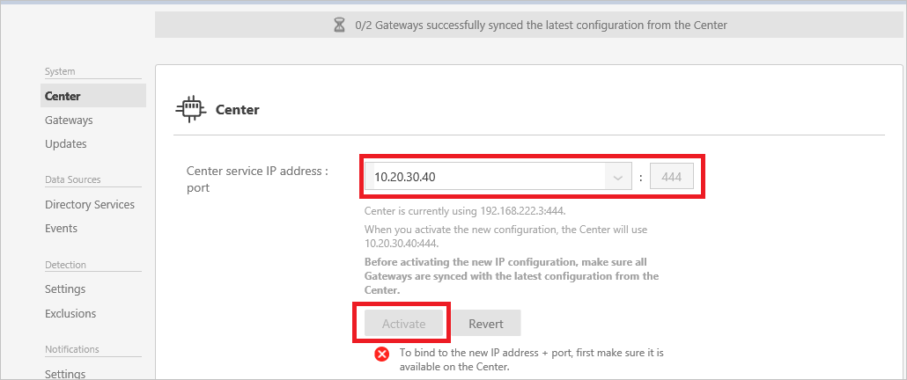

*적용 대상: Advanced Threat Analytics 버전 1.7*

# ATA 구성 변경 - ATA 센터 IP 주소

>[!div class="step-by-step"]
[ATA 센터 인증서 »](modifying-ata-config-centercert.md)

초기 배포 후 ATA 센터를 수정할 때는 신중하게 해야 합니다. IP 주소와 포트 또는 인증서를 업데이트할 때는 다음 절차를 사용합니다.

## ATA 센터 서버에서 사용하는 IP 주소 변경
ATA 센터 IP 주소와 포트 또는 인증서를 변경해야 하는 경우 다음 사항을 고려합니다.

ATA 게이트웨이는 연결해야 하는 ATA 센터의 IP 주소를 로컬로 저장합니다. ATA 게이트웨이는 정기적으로 ATA 센터에 연결하고 구성 변경 내용을 끌어옵니다. ATA 게이트웨이가 ATA 센터에 연결하는 방법은 두 단계로 변경합니다.

-   첫 번째 단계 – ATA 센터 서비스에서 사용할 IP 주소 및 포트를 업데이트합니다. 이때 ATA 센터는 여전히 원래 IP 주소에서 수신 대기하고, ATA 게이트웨이가 다음 번에 해당 구성을 동기화할 때 ATA 센터용 IP 주소를&2;개 갖게 됩니다. ATA 게이트웨이는 원래(첫 번째) IP 주소를 사용하여 연결할 수 있으면 새 IP 주소 및 포트의 사용을 시도하지 않습니다.

-   두 번째 단계 – 모든 ATA 게이트웨이가 업데이트된 구성과 동기화된 후에는 ATA 센터가 수신 대기하는 새 IP 주소 및 포트를 활성화합니다. 새 IP 주소를 활성화하면 ATA 센터 서비스가 해당 새 IP 주소에 바인딩됩니다. ATA 게이트웨이는 원래 주소에 연결할 수 없으며, 이제 ATA 센터에 대한 두 번째(새) IP 주소로 연결을 시도합니다. ATA 게이트웨이는 새 IP 주소로 ATA 센터 서비스에 연결한 후에 최신 구성을 끌어오고 ATA 센터에 대해 단일 IP 주소를 갖게 됩니다. (해당 프로세스를 다시 시작하지 않은 경우)

> [!NOTE]
> -   ATA 게이트웨이가 첫 번째 단계 동안 오프라인 상태가 되어 업데이트된 구성을 받지 못하면 ATA 게이트웨이에서 구성 JSON 파일을 수동으로 업데이트해야 합니다.
> -   새 IP 주소가 ATA 센터 서버에 설치되면 구성을 변경할 때 IP 주소 목록에서 선택할 수 있습니다. 그러나 몇 가지 이유로 ATA 센터 서버에서 IP 주소를 설치할 수 없는 경우 사용자 지정 IP 주소를 선택한 후 수동으로 추가할 수 있습니다. IP 주소가 서버에 설치될 때까지 새 IP 주소를 활성화할 수 없습니다.
> -   새 IP 주소를 활성화한 후 새 데이터 게이트웨이 배포해야 하는 경우 ATA 게이트웨이 설치 패키지를 다시 다운로드해야 합니다.

1.  ATA 콘솔을 엽니다.

2.  도구 모음에서 설정 옵션을 선택하고 **구성**을 선택합니다.

    

3.  **Center**(센터)를 클릭합니다.

4.  **Center service IP address : port**(센터 서비스 IP 주소: 포트)에서 기존 IP 주소 중 하나를 선택하거나 **Add custom IP address**(사용자 지정 IP 주소 추가)를 선택하고 IP 주소를 입력합니다.

5.  **저장**을 클릭합니다.

6.  최신 구성과 동기화된 ATA 게이트웨이 수에 대한 알림이 표시됩니다.

    

    >[!IMPORTANT]
    >새 구성을 활성화하기 전에 모든 ATA 게이트웨이가 최신 구성으로 동기화되었는지 확인하세요. 모든 ATA 게이트웨이가 동기화되기 전에 새 구성을 활성화하면 ATA 게이트웨이가 예상대로 작동하지 않을 수 있습니다. ATA 게이트웨이가 동기화되지 않은 경우 활성화를 클릭하면 다음과 같은 오류가 표시됩니다.
    >
    >    

7.  모든 ATA 게이트웨이가 동기화된 후 **활성화**를 클릭하여 새 IP 주소를 활성화합니다.

    > [!NOTE]
    > 사용자 지정 IP 주소를 입력한 경우 IP 주소가 ATA 센터에 설치될 때까지 **활성화**를 클릭할 수 없습니다.

8.  변경 내용이 활성화된 후 모든 ATA 게이트웨이가 해당 구성을 동기화할 수 있는지 확인합니다. 알림 표시줄에는 해당 구성과 성공적으로 동기화된 ATA 게이트웨이 수가 표시됩니다.

>[!div class="step-by-step"]
[ATA 센터 인증서 변경 »](modifying-ata-config-centercert.md)

## 참고 항목
- [ATA 콘솔 작업](working-with-ata-console.md)
- [ATA 포럼을 확인해 보세요!](https://aka.ms/ata-forum)

<!--HONumber=Feb17_HO1-->

