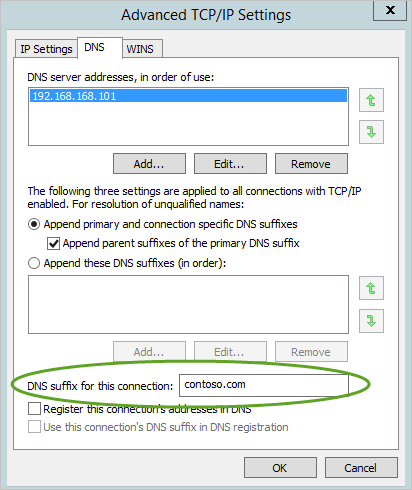

---
# required metadata

title: 설치 전 단계 | Microsoft Advanced Threat Analytics
description: 환경에서 ATA를 올바르게 배포하기 위한 요구 사항을 설명합니다.
keywords:
author: rkarlin
manager: stevenpo
ms.date: 04/28/2016
ms.topic: get-started-article
ms.prod: identity-ata
ms.service: advanced-threat-analytics
ms.technology: security
ms.assetid: 12bbdcc0-9ac2-4bad-8f26-06ee498351fa

# optional metadata

ROBOTS: noindex,nofollow
#audience:
#ms.devlang:
ms.reviewer: bennyl
ms.suite: ems
#ms.tgt_pltfrm:
#ms.custom:

---

# 설치 전 단계
이 문서에서는 환경에서 ATA를 올바르게 배포하기 위한 요구 사항을 설명합니다.

ATA는 ATA 센터와 ATA 게이트웨이의 두 가지 구성 요소로 이루어져 있습니다. ATA 구성 요소에 대한 자세한 내용은 [ATA 아키텍처](/advanced=threat-analytics/understand/ata-architecture)를 참조하세요.

[시작하기 전에](#before-you-start): 이 섹션에서는 ATA 설치를 시작하기 전에 수집해야 하는 정보와 확인해야 하는 계정 및 네트워크 엔터티를 제시합니다.

[ATA 센터](#ata-center-requirements): 이 섹션에는 ATA 센터 하드웨어, 소프트웨어 요구 사항 및 ATA 센터 서버에서 구성해야 하는 설정에 대해 설명합니다.

[ATA 게이트웨이](#ata-gateway-requirements): 이 섹션에는 ATA 게이트웨이 하드웨어, 소프트웨어 요구 사항 및 ATA 게이트웨이 서버에서 구성해야 하는 설정에 대해 설명합니다.

[ATA 콘솔](#ata-console): 이 섹션에서는 ATA 콘솔을 실행하기 위한 브라우저 요구 사항을 제시합니다.

## 시작하기 전에
이 섹션에서는 ATA 설치를 시작하기 전에 수집해야 하는 정보와 확인해야 하는 계정 및 네트워크 엔터티를 제시합니다.

-   Windows Server 2008 이상에서 실행 중인 **도메인 컨트롤러**

-   모니터링할 도메인의 **모든 개체**에 대한 읽기 권한이 있는 **사용자 계정 및 암호**

    > [!NOTE]
    > 도메인의 여러 OU(조직 구성 단위)에서 사용자 지정 ACL을 설정한 경우에는 선택한 사용자에게 해당 OU에 대한 읽기 권한이 있는지 확인하세요.

    선택 사항: 사용자에게 삭제된 개체 컨테이너에 대한 읽기 전용 권한이 있어야 합니다. 그러면 ATA가 도메인에서 대량 개체 삭제를 검색할 수 있습니다. 삭제된 개체 컨테이너에 대해 읽기 전용 권한을 구성하는 방법에 대한 자세한 내용은 [디렉터리 개체에 대한 권한 보기 또는 설정](https://technet.microsoft.com/library/cc816824%28v=ws.10%29.aspx) 항목에서 **삭제된 개체 컨테이너에 대한 권한 변경** 섹션을 참조하세요.

-   선택 사항: 네트워크 활동이 없는 사용자 계정을 사용합니다. 이 계정은 ATA 허니토큰 사용자로 구성됩니다. 허니토큰 사용자를 구성하려면 사용자 이름이 아닌 사용자 계정의 SID가 필요합니다.

-   선택 사항: ATA는 도메인 컨트롤러에서 보내고 받는 네트워크 트래픽을 수집 및 분석할 수 있을 뿐 아니라 Windows 이벤트 4776을 사용하여 ATA Pass-the-Hash 검색 기능을 추가로 개선할 수 있습니다. 이 이벤트는 SIEM에서 수신될 수도 있고 도메인 컨트롤러에서 Windows 이벤트 전달을 설정하여 수신할 수도 있습니다. 수집된 이벤트는 도메인 컨트롤러 네트워크 트래픽을 통해서는 사용할 수 없는 추가 정보를 ATA에 제공합니다.

-   VPN 및 Wi-Fi용으로 네트워크에서 사용되는 모든 서브넷 목록을 준비해 두면 유용할 수 있습니다. 이러한 서브넷은 매우 짧은 시간(몇 초나 몇 분) 내에 IP 주소를 장치 간에 재할당합니다.  이와 같은 단기 임대 서브넷을 확인하면 ATA가 장치 간의 신속한 IP 주소 재할당을 수행하기 위해 캐시 수명을 줄일 수 있습니다. 단기 임대 서브넷 구성에 대한 내용은 [ATA 설치](/advanced-threat-analytics/deployuse/install-ata)를 참조하세요.

## ATA 센터 요구 사항
이 섹션에서는 ATA 센터의 요구 사항에 대해 설명합니다.

ATA 센터는 Windows Server 2012 R2를 실행 중인 서버에 설치할 수 있습니다. Windows 업데이트를 실행하여 모든 중요 업데이트가 설치되어 있는지 확인하세요.
 모니터링 중인 도메인 컨트롤러 수와 각 도메인 컨트롤러의 로드에 따라 하드웨어 요구 사항이 결정됩니다.

ATA 센터를 가상 컴퓨터로 설치할 수 있습니다. 자세한 내용은 [포트 미러링 구성](/advanced-threat-analytics/PlanDesign/configure-port-mirroring)을 참조하세요.

ATA 센터를 가상 컴퓨터로 실행하는 경우 데이터베이스 손상 가능성을 방지하기 위해 새 검사점을 만들기 전에 서버를 종료합니다.

> [!NOTE]
> ATA 센터는 도메인이나 작업 그룹의 구성원인 서버에 설치할 수 있습니다.

**최소 요구 사항**

-   CPU - 8 코어

-   메모리 - 48GB

-   저장소 - 부하가 적은 도메인 컨트롤러 2개를 모니터링하기 위한 월별 1000GB

사용자 동작을 분석하려면 ATA 센터에 최소 21일 분량의 데이터가 필요합니다. 하드웨어 요구 사항에 대한 자세한 내용은 [ATA 용량 계획](/advanced-threat-analytics/plandesign/ata-capacity-planning)을 참조하세요.

> [!NOTE]
> 랩에 소수의 VM이 있는 ATA를 설치하려면 프로덕션 배포에 대한 지원 없이 ATA 콘솔과 상호 작용할 수 있도록 2개 이상의 코어, 4GB의 RAM 및 100GB의 저장소를 갖추는 것이 좋습니다.

### 시간 동기화
ATA 센터 서버, ATA 게이트웨이 서버 및 도메인 컨트롤러의 시간을 차이가 5분 이상 나지 않도록 동기화해야 합니다.

### BIOS 설정
ATA 데이터베이스를 사용하려면 BIOS에서 NUMA(Non-Uniform Memory Access)를 **사용하지 않도록 설정**해야 합니다. 시스템이 NUMA를 노드 인터리빙으로 참조할 수 있습니다. 이 경우에는 노드 인터리빙을 **사용하도록 설정**해야 합니다. 자세한 내용은 BIOS 설명서를 참조하세요.

### 네트워크 어댑터
요구 사항:

-   하나의 네트워크 어댑터

-   IP 주소 2개

ATA 센터와 ATA 게이트웨이 간의 통신은 포트 443에서 SSL을 사용하여 암호화됩니다. 또한 ATA 콘솔은 IIS에서 실행되며 포트 443에서 SSL을 사용하여 보호됩니다. **IP 주소 2개**를 사용하는 것이 좋습니다. ATA 센터 서비스는 포트 443을 첫 번째 IP 주소에 바인딩하고, IIS는 포트 443을 두 번째 IP 주소에 바인딩합니다.

> [!NOTE]
> IP 주소 하나와 서로 다른 포트 2개를 사용할 수도 있지만, IP 주소를 2개 사용하는 것이 좋습니다.

### 포트
아래 표에는 ATA 센터가 정상적으로 작동하도록 하려면 열어야 하는 최소한의 포트가 나와 있습니다.

이 표에서 IP 주소 1은 ATA 센터 서비스에 바인딩되고 IP 주소 2는 ATA 콘솔용 IIS 서비스에 바인딩됩니다.

|프로토콜|전송|포트|끝/시작|Direction|IP 주소|
|------------|-------------|--------|-----------|-------------|--------------|
|**SSL**(ATA 통신)|TCP|443 또는 구성 가능|ATA 게이트웨이|인바운드|IP 주소 1|
|**HTTP**|TCP|80|회사 네트워크|인바운드|IP 주소 2|
|**HTTPS**|TCP|443|회사 네트워크 및 ATA 게이트웨이|인바운드|IP 주소 2|
|**SMTP**(선택 사항)|TCP|25|SMTP 서버|아웃바운드|IP 주소 2|
|**SMTPS**(선택 사항)|TCP|465|SMTP 서버|아웃바운드|IP 주소 2|
|**syslog**(선택 사항)|TCP|514|Syslog 서버|아웃바운드|IP 주소 2|

### 인증서
ATA 게이트웨이에 CRL 배포 지점 액세스 권한이 있는지 확인합니다. ATA 게이트웨이가 인터넷에 액세스할 수 없으면 [CRL을 수동으로 가져오는 절차](https://technet.microsoft.com/en-us/library/aa996972%28v=exchg.65%29.aspx)에 따라 전체 체인에 모든 CRL 배포 지점을 설치합니다.

ATA 센터를 쉽게 설치하려면 ATA 센터 설치하는 동안 자체 서명 인증서를 설치할 수 있습니다. 배포 후에는 자체 서명 인증서를 ATA 게이트웨이에 사용할 내부 인증 기관의 인증서로 바꿀 수 있습니다.

> [!NOTE]
> 자체 서명 인증서는 랩 배포용으로만 사용해야 합니다.

ATA 센터에는 다음 서비스용 인증서가 필요합니다.

-   IIS(인터넷 정보 서비스) - 웹 서버 인증서

-   ATA 센터 서비스 - 서버 인증 인증서

> [!NOTE]
> 다른 컴퓨터에서 ATA 콘솔에 액세스하려는 경우 해당 컴퓨터가 IIS에서 사용 중인 인증서를 신뢰하는지 확인해야 합니다. 그렇지 않으면 로그인 페이지가 표시되기 전에 웹 사이트 보안 인증서에 문제가 있다는 경고 페이지가 표시됩니다.

## ATA 게이트웨이 요구 사항
ATA 게이트웨이는 Windows Server 2012 R2를 실행 중인 서버에 설치할 수 있습니다.

Windows 업데이트를 실행하여 모든 **중요** 업데이트를 설치했는지 확인하세요.
ATA 게이트웨이를 설치하기 전에 [KB2919355](https://support.microsoft.com/en-us/kb/2919355/) 업데이트가 설치되었는지 확인합니다.

Windows PowerShell cmdlet `[Get-HotFix -Id kb2919355]`를 실행하여 이 업데이트가 설치되었는지를 확인할 수 있습니다.

> [!NOTE]
> -   ATA 게이트웨이는 도메인이나 작업 그룹의 구성원인 서버에 설치할 수 있습니다.
> -   도메인 컨트롤러에는 ATA 게이트웨이를 설치할 수 없습니다.

ATA 게이트웨이가 설치된 가상 컴퓨터를 사용하는 방법에 대한 자세한 내용은 [포트 미러링 구성](/ATA/plandesign/configure-port-mirroring.html)을 참조하세요.

> [!NOTE]
> ATA 게이트웨이를 가상 컴퓨터로 실행하는 경우 데이터베이스 손상 가능성을 방지하기 위해 새 검사점을 만들기 전에 서버를 종료합니다.

도메인 컨트롤러에서 보내고 받는 네트워크 트래픽의 양에 따라 ATA 게이트웨이 하나가 여러 도메인 컨트롤러를 모니터링할 수 있습니다.

**최소 요구 사항:**

-   CPU - 4 코어

-   메모리 - 8GB

-   저장소 - OS용의 충분한 공간 + ATA용 10GB + 크래시 덤프 = 100GB 이상

자세한 내용은 [ATA 용량 계획](/advanced-threat-analytics/plandesign/ata-capacity-planning)을 참조하세요.

### 전원 설정
성능을 최적화하려면 ATA 게이트웨이의 **전원 옵션**을 **고성능**으로 설정합니다.

### 시간 동기화
ATA 센터 서버와 ATA 게이트웨이 서버의 시간 차이가 5분을 넘지 않도록 동기화해야 합니다.

또한 ATA 게이트웨이 및 ATA 게이트웨이가 연결되는 도메인 컨트롤러의 시간도 차이가 5분 이상 나지 않도록 동기화해야 합니다.

### 네트워크 어댑터
ATA 게이트웨이를 사용하려면 관리 어댑터와 캡처 어댑터가 각각 하나 이상 필요합니다.

-   **관리 어댑터** - 회사 네트워크 통신에 사용됩니다. 다음 정보를 사용하여 이 어댑터를 구성해야 합니다.

    -   기본 게이트웨이를 포함하는 고정 IP 주소

    -   기본 설정 DNS 서버와 대체 DNS 서버

    -   **이 연결의 DNS 접미사**는 모니터링 중인 각 도메인의 도메인 DNS 이름이어야 합니다.

        

        > [!NOTE]
        > ATA 게이트웨이가 도메인의 구성원이면 관리 어댑터는 자동으로 구성됩니다.

-   **캡처 어댑터** -도메인 컨트롤러에서 보내고 받는 트래픽을 캡처하는 데 사용됩니다.

    > [!IMPORTANT]
    > -   캡처 어댑터용 포트 미러링은 도메인 컨트롤러 네트워크 트래픽의 대상으로 구성합니다. 자세한 내용은 [포트 미러링 구성](/ATA/PlanDesign/configure-port-mirroring.html)을 참조하세요. 일반적으로는 네트워킹 또는 가상화 팀과 협의하여 포트 미러링을 구성해야 합니다.
    > -   기본 게이트웨이 및 DNS 서버 주소가 없는 라우팅 불가능 고정 IP 주소를 환경에 대해 구성합니다. 예를 들어 1.1.1.1/32와 같이 구성할 수 있습니다. 이렇게 하면 캡처 네트워크 어댑터가 트래픽을 최대한 캡처할 수 있으며, 관리 네트워크 어댑터를 사용하여 필요한 네트워크 트래픽을 보내고 받을 수 있습니다.

### 포트
아래 표에는 관리 어댑터에 구성된 ATA 게이트웨이에 필요한 최소한의 포트가 나와 있습니다.

|프로토콜|전송|포트|끝/시작|Direction|
|------------|-------------|--------|-----------|-------------|
|LDAP|TCP 및 UDP|389|도메인 컨트롤러|아웃바운드|
|보안 LDAP(LDAPS)|TCP|636|도메인 컨트롤러|아웃바운드|
|글로벌 카탈로그에 대한 LDAP|TCP|3268|도메인 컨트롤러|아웃바운드|
|글로벌 카탈로그에 대한 LDAPS|TCP|3269|도메인 컨트롤러|아웃바운드|
|Kerberos|TCP 및 UDP|88|도메인 컨트롤러|아웃바운드|
|Netlogon|TCP 및 UDP|445|도메인 컨트롤러|아웃바운드|
|Windows 시간|UDP|123|도메인 컨트롤러|아웃바운드|
|DNS|TCP 및 UDP|53|DNS 서버|아웃바운드|
|NTLM over RPC|TCP|135|네트워크의 모든 장치|아웃바운드|
|NetBIOS|UDP|137|네트워크의 모든 장치|아웃바운드|
|SSL|TCP|443 또는 센터 서비스용으로 구성된 포트|ATA 센터:  -   센터 서비스 IP 주소 -   IIS IP 주소|아웃바운드|
|syslog(선택 사항)|UDP|514|SIEM 서버|인바운드|

> [!NOTE]
> ATA 게이트웨이가 수행하는 확인 프로세스의 일부분으로 ATA 게이트웨이에서 네트워크의 장치에 대해 다음 포트를 인바운드로 열어야 합니다.
>
> -   NTLM over RPC
> -   NetBIOS

### 인증서
ATA 센터를 쉽게 설치하려면 ATA 센터 설치하는 동안 자체 서명 인증서를 설치할 수 있습니다. 배포 후에는 자체 서명 인증서를 ATA 게이트웨이에 사용할 내부 인증 기관의 인증서로 바꿀 수 있습니다.

> [!NOTE]
> 자체 서명 인증서는 랩 배포용으로만 사용해야 합니다.

**서버 인증**을 지원하는 인증서를 로컬 컴퓨터 저장소의 ATA 게이트웨이 컴퓨터 저장소에 설치해야 합니다. ATA 센터가 이 인증서를 신뢰해야 합니다.

## ATA 콘솔
다음과 같은 브라우저를 통해 ATA 콘솔에 액세스합니다.

-   Internet Explorer 버전 10 이상

-   Google Chrome 40 이상

-   스크린 너비 해상도가 1700픽셀 이상인 브라우저

## 참고 항목
[ATA 아키텍처](/advanced-threat-analytics/understand/ata-architecture)
 [ATA 설치](/advanced-threat-analytics/deployuse/install-ata)
 [지원이 필요한 경우 포럼을 확인하세요.](https://social.technet.microsoft.com/Forums/security/en-US/home?forum=mata)

<!--HONumber=Apr16_HO2-->

