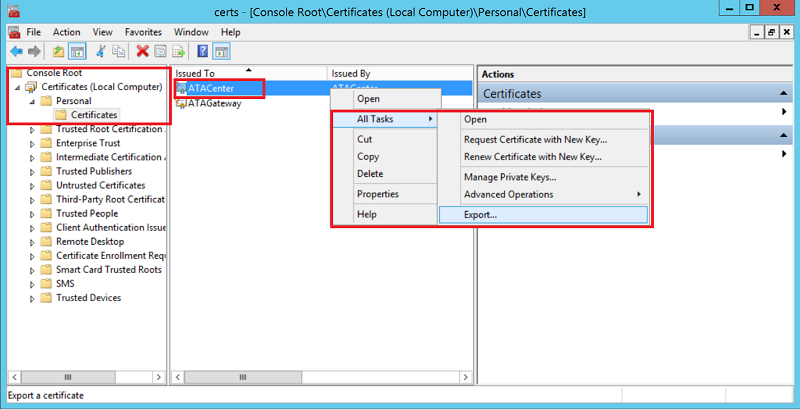
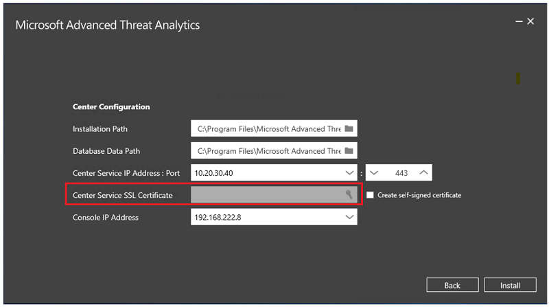

*적용 대상: Advanced Threat Analytics 버전 1.7*

# ATA 재해 복구
이 문서에서는 ATA 센터 기능이 손실되었지만 ATA 게이트웨이가 여전히 작동하는 경우 ATA 센터를 신속하게 복구하고 ATA 기능을 복원하는 방법을 설명합니다. 

>[!NOTE]
> 설명하는 프로세스에서는 이전에 검색한 의심스러운 활동을 복구하지는 않지만 ATA 센터의 기능을 완전하게 복원합니다. 또한 일부 동작 검색에 필요한 학습 기간이 다시 시작되지만, ATA에서 제공하는 대부분의 검색은 ATA 센터가 복원된 후 작동합니다. 

## ATA 센터 구성 백업

1. ATA 센터 구성은 매시간 파일로 백업됩니다. ATA 센터 구성의 최신 백업 복사본을 찾아서 별도 컴퓨터에 저장하세요. 이러한 파일을 찾는 방법에 대한 자세한 내용은 [ATA 구성 내보내기 및 가져오기 ](/advanced-threat-analytics/deploy-use/ata-configuration-file)를 참조하세요. 
2. ATA 센터 인증서를 내보냅니다.
    1. 인증서 관리자에서 **인증서(로컬 컴퓨터)** -> **개인** ->**인증서**로 이동하고 **ATA Center**(ATA 센터)를 선택합니다.
    2. **ATA Center**(ATA 센터)를 마우스 오른쪽 단추로 클릭하고 **All Tasks**(모든 작업), **내보내기**를 차례로 선택합니다. 
     
    3. 지침에 따라 인증서를 내보내고 개인 키도 내보냈는지 확인합니다.
    4. 내보낸 인증서 파일을 별도 컴퓨터에 백업합니다.

  > [!NOTE] 
  > 개인 키를 내보낼 수 없는 경우 [ATA 센터 인증서 변경](/advanced-threat-analytics/deploy-use/modifying-ata-config-centercert)에 설명된 것처럼 새 인증서를 만들고 ATA에 배포한 다음 내보내야 합니다. 

## ATA 센터 복구

1. 이전 ATA 센터 컴퓨터와 동일한 IP 주소 및 컴퓨터 이름을 사용하여 새 Windows Server 컴퓨터를 만듭니다.
4. 위에서 백업한 인증서를 새 서버에 가져옵니다.
5. 새로 만든 Windows Server에서 [ATA 센터 배포](/advanced-threat-analytics/deploy-use/install-ata-step1)에 대한 지침을 따릅니다. ATA 게이트웨이는 다시 배포하지 않아도 됩니다. 인증서에 대한 메시지가 표시되면 ATA 센터 구성을 백업할 때 내보낸 인증서를 제공하세요. 

6. 백업된 ATA 센터 구성을 가져옵니다.
    1. MongoDB에서 기본 ATA 센터 시스템 프로필 문서를 제거합니다. 
        1. **C:\Program Files\Microsoft Advanced Threat Analytics\Center\MongoDB\bin**으로 이동합니다. 
        2. `mongo.exe`을 실행합니다. 
        3. 기본 시스템 프로필을 제거하려면 이 명령을 실행하세요.`db.SystemProfile.remove({})`
    2. 1단계의 백업 파일을 사용하여 다음 명령을 실행합니다. `mongoimport.exe --db ATA --collection SystemProfile --file "<SystemProfile.json backup file>" --upsert` 
    백업 파일을 찾고 가져오는 방법에 대한 자세한 설명은 [ATA 구성 내보내기 및 가져오기](/advanced-threat-analytics/deploy-use/ata-configuration-file)를 참조하세요. 
    3. 가져온 후 다음 명령을 실행하여 일부 기본 시스템 프로필을 제거하고 새 환경에 맞게 다시 설정합니다. `db.SystemProfile.remove({$or:[{"_t":"DetectorProfile"}, "_t":"DirectoryServicesSystemProfile"}]}) `
    4. ATA 콘솔을 엽니다. [구성/게이트웨이] 탭 아래에 연결된 모든 ATA 게이트웨이가 표시됩니다. 
    5. [**Directory services user**](/advanced-threat-analytics/deploy-use/install-ata-step2)(디렉터리 서비스 사용자)를 정의하고 [**Domain controller synchronizer**](/advanced-threat-analytics/deploy-use/install-ata-step5)(도메인 컨트롤러 동기화 장치)를 선택합니다. 

## 참고 항목
- [ATA 필수 구성 요소](/advanced-threat-analytics/plan-design/ata-prerequisites)
- [ATA 용량 계획](/advanced-threat-analytics/plan-design/ata-capacity-planning)
- [이벤트 수집 구성](/advanced-threat-analytics/deploy-use/configure-event-collection)
- [Windows 이벤트 전달 구성](/advanced-threat-analytics/deploy-use/configure-event-collection#configuring-windows-event-forwarding)
- [ATA 포럼을 확인해 보세요!](https://social.technet.microsoft.com/Forums/security/home?forum=mata)
