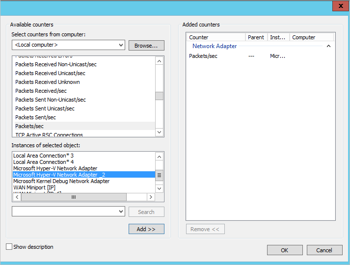

*적용 대상: Advanced Threat Analytics 버전 1.8*

# ATA 용량 계획

이 항목에서는 네트워크를 모니터링하는 데 필요한 ATA 서버 수를 결정하는 데 도움이 되는 정보를 제공합니다. 필요한 ATA 게이트웨이 및/또는 ATA 경량 게이트웨이 수와 ATA 센터 및 ATA 게이트웨이에 대한 서버 용량을 이해하는 데에도 도움이 됩니다.

> [!NOTE] 
> 이 문서에 설명된 성능 요구 사항에 충족하기만 하면 모든 IaaS 공급 업체에 ATA Center를 배포할 수 있습니다.

##크기 조정 도구 사용

ATA 배포의 용량을 결정할 때 가장 간단한 권장 방법은 [ATA Sizing Tool](http://aka.ms/atasizingtool)(ATA 크기 조정 도구)을 사용하는 것입니다. ATA 크기 조정 도구를 실행하고 Excel 파일 결과에서 다음 필드를 사용하여 필요한 ATA 용량을 결정합니다.

- ATA 센터 CPU 및 메모리: ATA 센터 테이블 결과 파일의 **Busy Packets/sec**(사용 중인 패킷/초) 필드를 [ATA 센터 테이블](#ata-center-sizing)의 **PACKETS PER SECOND**(패킷/초) 필드와 비교합니다.

- ATA 센터 저장소: ATA 센터 테이블 결과 파일의 **Avg Packets/sec**(평균 패킷/초) 필드를 [ATA 센터 테이블](#ata-center-sizing)의 **PACKETS PER SECOND**(패킷/초) 필드와 비교합니다.
- ATA 게이트웨이: 결과 파일의 ATA 센터 테이블에 있는 **Busy Packets/sec**(사용 중인 패킷/초) 필드를 [선택한 게이트웨이 유형](#choosing-the-right-gateway-type-for-your-deployment)에 따라 [ATA 게이트웨이 테이블](#ata-gateway-sizing) 또는 [ATA 경량 게이트웨이 테이블](#ata-lightweight-gateway-sizing)의 **PACKETS PER SECOND**(패킷/초) 필드와 비교합니다.

어떤 이유로든 ATA 크기 조정 도구를 사용할 수 없으면 24시간 동안 짧은 수집 간격(약 5초)으로 모든 도메인 컨트롤러에서 패킷/초 카운터 정보를 수동으로 수집합니다. 그런 다음 각 도메인 컨트롤러에 대해 일일 평균과 최대 사용 기간(15분) 평균을 계산해야 합니다.
다음 섹션에서는 하나의 도메인 컨트롤러에서 패킷/초 카운터를 수집하는 방법에 대해 지침을 제공합니다.

### ATA 센터 크기 결정

사용자 동작을 분석하려면 ATA 센터에 최소 30일 분량(권장)의 데이터가 필요합니다.
 

|모든 데이터 센터의 초당 패킷 수|CPU(코어&#42;)|메모리(GB)|매일 데이터베이스 저장소 사용량(GB)|매월 데이터베이스 저장소 사용량(GB)|IOPS&#42;&#42;|
|---------------------------|-------------------------|-------------------|---------------------------------|-----------------------------------|-----------------------------------|
|1,000|2|32|0.3|9|30(100)
|40,000|4|48|12|360|500(750)
|200,000|8|64|60|1,800|1,000(1,500)
|400,000|12|96|120|3,600|2,000(2,500)
|750,000|24|112|225|6,750|2,500(3,000)
|1,000,000|40|128|300|9,000|4,000 (5,000)

&#42;실제 코어만 포함되며 하이퍼스레딩 코어는 포함되지 않습니다.

&#42;&#42;평균 수(최대 수)입니다.
> [!NOTE]
> -   ATA 센터는 모니터링되는 모든 도메인 컨트롤러에서 최대 백만 개의 누적 초당 패킷을 처리할 수 있습니다. 일부 환경에서는 동일한 ATA 데이터 센터에서 400,000개 이상의 전체 트래픽을 처리할 수 있습니다. 이러한 환경에 대한 지원은 askcesec@microsoft.com으로 문의하세요.
> -   위의 표에 나와 있는 저장소 크기는 순수 저장소 값입니다. 향후 확장을 고려하여 데이터베이스가 있는 디스크에 20% 이상의 사용 가능한 공간을 확보해 두어야 합니다.
> -   사용 가능한 공간이 최소값인 20% 또는 100GB에 도달하면 가장 오래된 데이터 컬렉션이 삭제됩니다. 5%나 50GB의 사용 가능한 공간만이 남을 때까지 삭제 작업이 계속 수행되며, 그 이후에는 데이터 수집의 작동이 중지됩니다.
> - 이 문서에 설명된 성능 요구 사항에 충족하기만 하면 모든 IaaS 공급 업체에 ATA Center를 배포할 수 있습니다.
> -   읽기 및 쓰기 활동에 대한 저장소 대기 시간은 10ms 미만이어야 합니다.
> -   읽기와 쓰기 활동의 비율은 초당 패킷 수가 100,000개 미만인 경우 약 1:3이고 100,000개를 초과하는 경우에는 1:6입니다.
> -   가상 컴퓨터로 실행하는 경우 동적 메모리 또는 다른 메모리 풍선 알림 기능은 지원되지 않습니다.
> -   성능을 최적화하려면 ATA 센터의 **전원 옵션**을 **고성능**으로 설정합니다. 
> -   물리적 서버에서 작업할 때 ATA 데이터베이스를 사용하려면 BIOS에서 NUMA(Non-Uniform Memory Access)를 **사용하지 않도록 설정**해야 합니다. 시스템이 NUMA를 노드 인터리빙으로 참조할 수 있습니다. 이 경우 NUMA를 사용하지 않으려면 노드 인터리빙을 **사용하도록 설정**해야 합니다. 자세한 내용은 BIOS 설명서를 참조하세요. 이는 ATA 센터가 가상 서버에서 실행 중인 경우 관련이 없습니다.

## 배포에 맞는 올바른 게이트웨이 형식 선택

ATA 배포에서 ATA 게이트웨이 형식의 모든 조합이 지원됩니다.

- ATA 게이트웨이 전용
- ATA 경량 게이트웨이 전용
- 두 형식의 조합

게이트웨이 배포 유형을 결정할 때는 다음 혜택을 고려하세요.

|게이트웨이 형식|이점|비용|배포 토폴로지|도메인 컨트롤러 사용|
|----|----|----|----|-----|
|ATA Gateway|대역 외 배포의 경우 공격자가 ATA가 있는지 검색하기가 어려움|높음|도메인 컨트롤러와 함께 설치(대역 외)|초당 최대 50,000 패킷 지원|
|ATA 경량 게이트웨이|전용 서버 및 포트 미러링 구성 필요 없음|소문자|도메인 컨트롤러에 설치|초당 최대 10,000 패킷 지원|

다음은 도메인 컨트롤러를 ATA 경량 게이트웨이로 다루어야 하는 시나리오의 예입니다.

- 분기 사이트

- 클라우드(IaaS)에 배포된 가상 도메인 컨트롤러

다음은 도메인 컨트롤러를 ATA 게이트웨이로 다루어야 하는 시나리오의 예입니다.

- 본사 데이터 센터(초당 10,000 패킷보다 많은 도메인 컨트롤러 보유)

### ATA 경량 게이트웨이 크기 조정

하나의 ATA 경량 게이트웨이는 도메인 컨트롤러에서 생성되는 네트워크 트래픽 양에 따라 하나의 도메인 컨트롤러에 대한 모니터링을 지원할 수 있습니다. 

|초당 패킷 수&#42;|CPU(코어&#42;&#42;)|메모리(GB)&#42;&#42;&#42;|
|---------------------------|-------------------------|---------------|
|1,000|2|6|
|5,000|6|16|
    |10,000|10|24|

&#42;특정 ATA 경량 게이트웨이가 모니터링 중인 도메인 컨트롤러에서 초당 생성되는 총 패킷 수입니다.

&#42;&#42;이 도메인 컨트롤러에서 설치한 하이퍼 이외의 총 스레드 코어 수입니다. 용량을 계획할 때 ATA 경량 게이트웨이에 대 해 하이퍼 스레딩이 허용되지만 하이퍼 스레드 코어가 아닌 실제 코어를 계산해야 합니다.

&#42;&#42;&#42;이 도메인 컨트롤러에서 설치한 총 메모리 양입니다.

> [!NOTE]   
> -   ATA 경량 게이트웨이에 필요한 리소스가 도메인 컨트롤러에 없으면 도메인 컨트롤러 성능에는 영향을 주지 않지만 ATA 경량 게이트웨이가 예상대로 작동하지 않을 수 있습니다.
> -   가상 컴퓨터로 실행하는 경우 동적 메모리 또는 다른 메모리 풍선 알림 기능은 지원되지 않습니다.
> -   성능을 최적화하려면 ATA 경량 게이트웨이의 **전원 옵션**을 **고성능**으로 설정합니다.
> -   최소 5GB의 공간이 필요하며 ATA 이진 파일, [ATA 로그](troubleshooting-ata-using-logs.md) 및 [성능 로그](troubleshooting-ata-using-perf-counters.md)에 필요한 공간을 포함하여 10GB가 권장됩니다.

### ATA 게이트웨이 크기 결정

배포할 ATA 게이트웨이 수를 결정할 때는 다음 문제를 고려하세요.

-   **Active Directory 포리스트 및 도메인** 
    ATA는 하나의 Active Directory 포리스트에서 여러 도메인의 트래픽을 모니터링할 수 있습니다. 여러 Active Directory 포리스트를 모니터링하려면 별도의 ATA를 배포해야 합니다. 단일 ATA 배포를 서로 다른 여러 포리스트의 도메인 컨트롤러에서 네트워크 트래픽을 모니터링하도록 구성하지 마세요.

-   **포트 미러링** 
포트 미러링 고려 사항으로 인해 데이터 센터 또는 분기 사이트마다 여러 개의 ATA 게이트웨이를 배포해야 할 수 있습니다.

-   **용량** 
    모니터링 중인 도메인 컨트롤러의 네트워크 트래픽 양에 따라 ATA 게이트웨이 하나가 여러 도메인 컨트롤러를 모니터링할 수 있습니다. 
 

|초당 패킷 수&#42;|CPU(코어&#42;&#42;)|메모리(GB)|
|---------------------------|-------------------------|---------------|
|1,000|1|6|
|5,000|2|10|
|10,000|3|12|
|20,000|6|24|
|50,000|16|48|
&#42;하루 중 가장 바쁜 시간 동안 특정 ATA 게이트웨이가 모니터링 중인 모든 도메인 컨트롤러에서 초당 생성되는 평균 패킷 수입니다.

&#42;도메인 컨트롤러에서 포트 미러링되는 총 트래픽 양은 ATA 게이트웨이의 캡처 NIC 용량을 초과할 수 없습니다.

&#42;&#42;하이퍼스레딩은 사용하지 않도록 설정해야 합니다.

> [!NOTE] 
> -   동적 메모리가 지원되지 않습니다.
> -   성능을 최적화하려면 ATA 게이트웨이의 **전원 옵션**을 **고성능**으로 설정합니다.
> -   최소 5GB의 공간이 필요하며 ATA 이진 파일, [ATA 로그](troubleshooting-ata-using-logs.md) 및 [성능 로그](troubleshooting-ata-using-perf-counters.md)에 필요한 공간을 포함하여 10GB가 권장됩니다.

## 도메인 컨트롤러 트래픽 예측

여러 가지 도구를 사용하여 도메인 컨트롤러의 초당 평균 패킷 수를 확인할 수 있습니다. 이 카운터를 추적하는 도구가 없는 경우 성능 모니터를 사용하여 필요한 정보를 수집할 수 있습니다.

초당 패킷 수를 확인하려면 각 도메인 컨트롤러에서 다음 단계를 수행합니다.

1.  성능 모니터를 엽니다.

    

2.  **데이터 수집기 집합**을 확장합니다.

    

3.  **사용자 정의**를 마우스 오른쪽 단추로 클릭하고 **새로 만들기** &gt; **데이터 수집기 집합**을 선택합니다.

    

4.  수집기 집합의 이름을 입력하고 **수동으로 만들기(고급)**를 선택합니다.

5.  **어떤 형식의 데이터를 포함하시겠습니까?**에서 **데이터 로그 만들기**를 선택하고 아래쪽에서 성능 카운터 확인란을 선택합니다.

    

6.  **어떤 성능 카운터를 기록하시겠습니까?**에서 **추가**를 클릭합니다.

7.  **네트워크 어댑터**를 확장하고 **Packets/sec**를 선택한 후에 적절한 인스턴스를 선택합니다. 어떤 카운터를 추가해야 하는지 모르는 경우 **&lt;모든 인스턴스&gt;**를 선택하고 **추가**, **확인**을 차례로 클릭하면 됩니다.

    > [!NOTE]
    > 이 작업을 수행하려면 명령줄에서 `ipconfig /all`을 실행하여 구성 및 어댑터의 이름을 확인합니다.

    

8.  **샘플 간격**을 **1초**로 변경합니다.

9. 데이터를 저장할 위치를 설정합니다.

10. **데이터 수집기 집합 만들기**에서 **이 데이터 수집기 집합을 지금 시작**을 선택하고 **마침**을 클릭합니다.

    이제 만든 데이터 수집기 집합이 나타나고 해당 집합이 작동함을 나타내는 녹색 삼각형이 표시됩니다.

11. 24시간이 지난 후 데이터 수집기 집합을 마우스 오른쪽 단추로 클릭하고 **중지**를 선택하여 데이터 수집기 집합을 중지합니다.

    

12. 파일 탐색기에서 .blg 파일이 저장된 폴더를 찾은 다음 해당 파일을 두 번 클릭하여 성능 모니터에서 엽니다.

13. Packets/sec 카운터를 선택하고 평균값과 최대값을 기록합니다.

    

## 참고 항목

- [ATA 필수 구성 요소](ata-prerequisites.md)
- [ATA 아키텍처](ata-architecture.md)
- [ATA 포럼을 확인해 보세요!](https://social.technet.microsoft.com/Forums/security/home?forum=mata)
