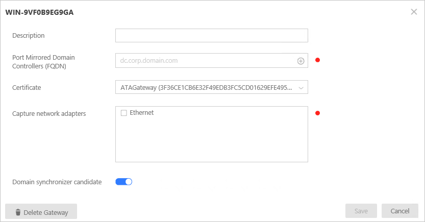
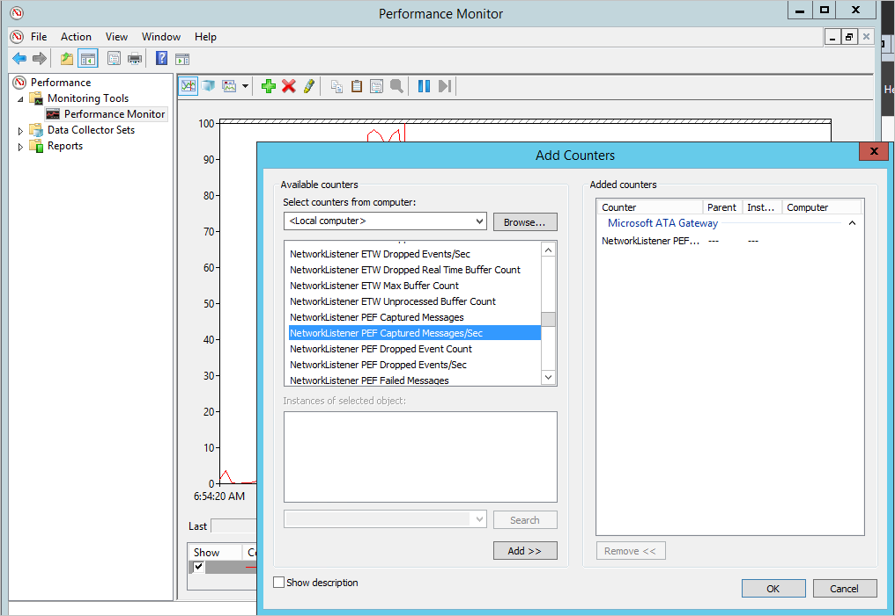

*적용 대상: Advanced Threat Analytics 버전 1.8*

# ATA 설치 - 5단계

>[!div class="step-by-step"]
[« 4단계](install-ata-step4.md)
[6단계 »](install-ata-step6.md)

## 5단계. ATA Gateway 설정 구성
ATA Gateway를 설치한 후에는 다음 단계를 수행하여 ATA Gateway에 대한 설정을 구성합니다.

1.  ATA 콘솔에서 **구성**으로 이동하고 **시스템**에서 **게이트웨이**를 선택합니다.
   
     

2.  구성할 게이트웨이를 클릭하고 다음 정보를 입력합니다.

    

  - **설명**: ATA 게이트웨이에 대한 설명을 입력합니다(옵션).
  - **FQDN(Port Mirrored Domain Controller)** (ATA 게이트웨이에 필요하며 ATA 경량 게이트웨이에는 설정할 수 없음): 도메인 컨트롤러의 전체 FQDN을 입력하고 더하기 기호를 클릭하여 목록에 추가합니다. 예를 들면  **dc01.contoso.com**과 같습니다.

      다음 정보는 **도메인 컨트롤러** 목록에 입력한 서버에 적용됩니다.
      - ATA Gateway에서 포트 미러링을 통해 모니터링하는 트래픽의 모든 도메인 컨트롤러가 **도메인 컨트롤러** 목록에 나열되어야 합니다. 도메인 컨트롤러가 **도메인 컨트롤러** 목록에 나열되지 않은 경우 의심스러운 활동 검색이 예상대로 작동하지 않을 수 있습니다.
      - 목록에 있는 하나 이상의 도메인 컨트롤러는 글로벌 카탈로그여야 합니다. 이를 통해 ATA는 포리스트의 다른 도메인에 있는 컴퓨터 및 사용자 개체를 확인할 수 있습니다.

  - **네트워크 어댑터 캡처**(필수):
  - 전용 서버의 ATA 게이트웨이의 경우 대상 미러 포트로 구성된 네트워크 어댑터를 선택합니다. 해당 어댑터는 미러링된 도메인 컨트롤러 트래픽을 수신하게 됩니다.
  - ATA 경량 게이트웨이의 경우 조직에서 다른 컴퓨터와의 통신에 사용되는 모든 네트워크 어댑터가 여기 해당되어야 합니다.

  - **도메인 동기화 장치 후보**: 도메인 동기화 장치 후보로 설정된 모든 ATA 게이트웨이는 ATA와 Active Directory 도메인 간의 동기화를 수행할 수 있습니다. 도메인 크기에 따라 초기 동기화에 다소 시간이 걸릴 수도 있으며 리소스를 많이 사용합니다. 기본적으로 ATA 게이트웨이가 도메인 동기화 장치 후보로 설정됩니다.
   모든 원격 사이트 ATA 게이트웨이를 도메인 동기화 장치 후보가 되지 않도록 설정하는 것이 좋습니다.
   도메인 컨트롤러가 읽기 전용인 경우 도메인 동기화 장치 후보로 설정하지 마세요. 자세한 내용은 [ATA 아키텍처](ata-architecture.md#ata-lightweight-gateway-features)를 참조하세요.

  > [!NOTE] 
  > 설치 후 ATA 게이트웨이 서비스를 처음 시작하는 데 몇 분 정도 걸립니다. 네트워크 캡처 파서의 캐시를 작성하기 때문입니다.
  > 구성 변경은 ATA 게이트웨이와 ATA Center 간의 예정된 다음 동기화 시 ATA 게이트웨이에 적용됩니다.

3. 선택적으로 [Syslog 수신기 및 Windows 이벤트 전달 컬렉션](configure-event-collection.md)을 설정할 수 있습니다. 
4. 이후 버전 릴리스에서 ATA 센터를 업데이트하면 이 ATA 게이트웨이가 자동으로 업데이트되도록 **ATA 게이트웨이 자동 업데이트**를 사용합니다.

5. **Save**을 클릭합니다.

## 설치 유효성 검사
ATA 게이트웨이가 성공적으로 배포되었는지 확인하려면 다음을 확인합니다.

1.  **Microsoft Advanced Threat Analytics Gateway** 서비스가 실행 중인지 확인합니다. ATA 게이트웨이 설정을 저장한 후 서비스를 시작하는 데 몇 분 정도 걸릴 수 있습니다.

2.  서비스가 시작되지 않는 경우 기본 폴더 “%programfiles%\Microsoft Advanced Threat Analytics\Gateway\Logs”에 있는 “Microsoft.Tri.Gateway-Errors.log” 파일을 검토하고 [ATA 문제 해결](troubleshooting-ata-known-errors.md)에서 도움말을 확인하세요.

3.  이번에 처음으로 ATA Gateway를 설치한 경우 몇 분 후에 ATA 콘솔에 로그인하여 열려 있는 화면의 오른쪽을 살짝 밀어 알림 창을 엽니다. 콘솔 오른쪽의 알림 표시줄에 **최근에 학습된 엔터티** 목록이 표시됩니다.

4.  바탕 화면에서 **Microsoft Advanced Threat Analytics** 바로 가기를 클릭하여 ATA 콘솔에 연결합니다. ATA Center를 설치하는 데 사용한 것과 동일한 사용자 자격 증명으로 로그인합니다.
5.  콘솔의 검색 창에서 도메인의 사용자 또는 그룹과 같은 항목을 검색합니다.
6.  성능 모니터를 엽니다. 성능 트리에서 **성능 모니터**를 클릭한 다음 더하기 아이콘을 클릭하여 **카운터 추가**를 수행합니다. **Microsoft ATA Gateway**를 확장하고 아래의 **Network Listener PEF Captured Messages/Sec**으로 스크롤하여 이를 추가합니다. 그러면 그래프에 활동이 표시됩니다.

    

>[!div class="step-by-step"]
[« 4단계](install-ata-step4.md)
[6단계 »](install-ata-step6.md)

## 관련 동영상
- [ATA 배포 개요](https://channel9.msdn.com/Shows/Microsoft-Security/Overview-of-ATA-Deployment-in-10-Minutes)
- [올바른 ATA 게이트웨이 유형 선택](https://channel9.msdn.com/Shows/Microsoft-Security/ATA-Deployment-Choose-the-Right-Gateway-Type)

## 참고 항목
- [ATA POC 배포 가이드](http://aka.ms/atapoc)
- [ATA 크기 조정 도구](http://aka.ms/atasizingtool)
- [ATA 포럼을 확인해 보세요!](https://social.technet.microsoft.com/Forums/security/home?forum=mata)
- [이벤트 수집 구성](configure-event-collection.md)
- [ATA 필수 구성 요소](ata-prerequisites.md)

