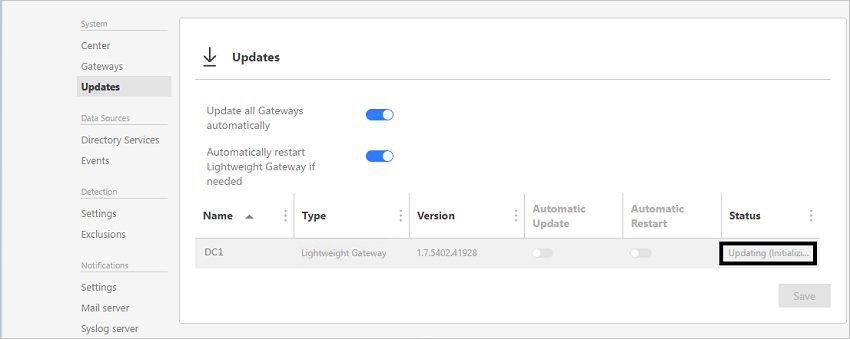

# ATA 버전 1.7의 새로운 기능
이 릴리스 정보에서는 이 버전의 Advanced Threat Analytics에서 알려진 문제에 대한 정보를 제공합니다.

## ATA 1.7 업데이트의 새로운 기능
ATA 1.7 업데이트에서는 다음 영역에 대한 향상된 기능을 제공합니다.

-   새롭거나 업데이트된 검색 기능

-   역할 기반 액세스 제어

-   Windows Server 2016 및 Windows Server 2016 Core에 대한 지원

-   사용자 환경 향상

-   사소한 변경 사항

### 새롭거나 업데이트된 검색 기능

- **디렉터리 서비스 열거를 사용하여 정찰** 정찰 단계 중 하나로 곡격자는 다양한 방법으로 네트워크에서 엔터티 정보를 수집합니다. SAM-R 프로토콜을 사용하는 디렉터리 서비스 열거 방식을 통해 공격자는 도메인에서 사용자와 그룹 목록을 가져와 다양한 엔터티 간 상호 작용을 이해할 수 있습니다. 

- **향상된 Pass-the-Hash 기능** Pass-the-Hash 검색을 향상하기 위해 엔터티 인증 패턴에 대한 별도의 동작 모델이 추가되었습니다. 이러한 모델을 사용하면 ATA는 엔터티 동작과 의심스러운 NTLM 인증의 상관 관계을 파악하고 실제 Pass-the-Hash 동작과 가양성 시나리오의 동작을 구별할 수 있습니다.

- **향상된 Pass-the-Ticket 기능** 일반적으로는 고급 공격, 특별하게는 Pass-the-Ticket 공격을 검색합니다. 이 경우 IP 주소와 컴퓨터 계정 간 상관 관계가 정확해야 합니다. 설계에 따라 IP 주소가 자주 변경되는 환경에서는 이 기능을 사용할 때 도전이 됩니다(예: 동일한 호스트를 공유하는 Wi-Fi 네트워크 및 여러 가상 컴퓨터). 이러한 어려움을 극복하고 Pass-the-Ticket 검색의 정확도를 개선하기 위해 ATA의 NNR(네트워크 이름 확인) 메커니즘이 상당히 향상되어 가양성이 줄어들었습니다.

- **비정상적인 동작에 대한 향상된 기능** ATA 1.7에서는 NTLM 인증 데이터가 비정상적인 동작 검색에 대한 데이터 원본으로 추가되어 네트워크에서의 엔터티 동작을 광범위화게 포함하는 알고리즘을 제공합니다. 

- **비정상적인 프로토콜 구현에 대한 향상된 기능** ATA는 이제 Kerberos 프로토콜의 비정상적인 프로토콜 구현과 NTLM 프로토콜에서 잘못된 추가 부분을 함께 검색합니다. 특히 Kerberos에 대한 이러한 새로운 이상 현상은 주로 Over-pass-the-Hash 공격에서 사용됩니다.

### 인프라

- **역할 기반 액세스 제어** RBAC(역할 기반 액세스 제어) 기능입니다. ATA 1.7에는 3개의 역할 ATA 관리자, ATA 분석가 및 ATA 경영진 역할이 있습니다.

- **Windows Server 2016 및 Windows Server Core에 대한 지원** ATA 1.7은 Windows Server 2008 R2 SP1(Server Core 제외), Windows Server 2012, Windows Server 2012 R2, Windows Server 2016(Core 포함, Nano 제외)을 실행하는 도메인 컨트롤러에 경량 게이트웨이 배포를 지원합니다. 또한 이 릴리스는 ATA 센터 및 ATA 데이터 센터 구성 요소에 대한 Windows Server 2016을 모두 지원합니다.

### 사용자 환경
- **구성 환경** 이 릴리스에서는 더 나은 사용자 환경과 여러 ATA 게이트웨이 사용을 통한 더 나은 환경 지원을 위해 ATA 구성 환경이 다시 설계되었습니다. 이 릴리스에는 또한 다양한 게이트웨이에 대한, 간단하지만 더 나은 자동 업데이트 관리를 위해 ATA 게이트웨이 업데이트 페이지가 도입되었습니다.

## 알려진 문제
이 버전에는 다음과 같은 알려진 문제가 존재합니다.

### 게이트웨이 자동 업데이트가 실패할 수 있음
**증상:** 속도가 느린 WAN 연결을 사용하는 환경에서 ATA 게이트웨이 업데이트가 업데이트 시간 제한(100초)에 도달하여 완료되지 않을 수 있습니다.
ATA 콘솔에서 ATA 게이트웨이의 상태가 장시간동안 "업데이트 중(패키지 다운로드 중)"일 경우 결국 실패합니다.
**해결 방법:** 이 문제를 해결하려면 ATA 콘솔에서 최신 ATA 게이트웨이 패키지를 다운로드하고 ATA 게이트웨이를 수동으로 업데이트합니다.

 > [!IMPORTANT]
 ATA에서 사용하는 인증서에 대한 인증서 자동 갱신은 지원되지 않습니다. 이러한 인증서를 사용할 경우 인증서가 자동으로 갱신될 때 ATA가 작동하지 않을 수 있습니다. 

### 브라우저에서 JIS 인코딩이 지원되지 않음
**증상:** JIS 인코딩을 사용하는 브라우저에서 ATA 콘솔이 예상대로 작동하지 않을 수 있습니다. **해결 방법:** 브라우저의 인코딩을 Unicode UTF-8로 변경합니다.
 
### VMware 사용 시 포트 미러 트래픽 삭제

VMware에 경량 게이트웨이를 사용하는 경우 포트 미러 트래픽 경고 삭제

도메인 컨트롤러를 VMware 가상 컴퓨터에서 사용하는 경우, **삭제된 포트 미러 네트워크 트래픽**에 대한 경고를 받을 수 있습니다. VMware의 구성이 일치하지 않아서 발생하는 문제일 수 있습니다. 이러한 경고를 방지하기 위해 가상 컴퓨터에서 다음 설정이 0 또는 사용 안 함으로 설정되어 있는지 확인하세요.  

- TsoEnable
- LargeSendOffload(IPv4)
- IPv4 TSO Offload

IPv4 Giant TSO Offload도 사용하지 않도록 설정하는 것이 좋습니다. 자세한 내용은 VMware 설명서를 참조하세요.

### 1.7 업데이트 1로 업데이트할 때 자동 게이트웨이 업데이트 실패

ATA 1.7에서 ATA 1.7 업데이트 1로 업데이트할 때 자동 ATA 게이트웨이 업데이트 프로세스와 게이트웨이 패키지를 사용한 게이트웨이 수동 설치가 모두 제대로 작동하지 않을 수 있습니다.
이 문제는 ATA를 업데이트하기 전에 ATA 센터에서 사용하는 인증서를 변경한 경우 발생합니다.
이 문제를 확인하려면 ATA 게이트웨이에서 **Microsoft.Tri.Gateway.Updater.log**를 검토하고 다음 예외를 찾아보세요. **System.Net.Http.HttpRequestException: 요청을 보내는 동안 오류가 발생했습니다. ---> System.Net.WebException: 기본 연결이 닫힘: 보내기에서 예기치 않은 오류가 발생했습니다. ---> System.IdentityModel.Tokens.SecurityTokenValidationException: 인증서 지문을 확인하지 못했습니다.**

이 문제를 해결하려면 인증서를 변경한 후 관리자 권한 명령 프롬프트에서 **%ProgramFiles%\Microsoft Advanced Threat Analytics\Center\MongoDB\bin** 위치로 이동하고 다음을 실행합니다.

1. Mongo.exe ATA(ATA는 대문자여야 함) 

2. CenterThumbprint=db.SystemProfile.find({_t:"CenterSystemProfile"}).toArray()[0].Configuration.SecretManagerConfiguration.CertificateThumbprint;

3. db.SystemProfile.update({_t:"ServiceSystemProfile"},{$set:{"Configuration.ManagementClientConfiguration.ServerCertificateThumbprint":CenterThumbprint}}, {multi: true})

### 의심스러운 활동 정보를 Excel로 내보내기에 실패할 수 있음
의심스러운 활동 정보를 Excel 파일로 내보내려고 할 때 다음과 같은 오류와 함께 작업에 실패할 수 있습니다. *오류 [BsonClassMapSerializer`1] System.FormatException: Microsoft.Tri.Common.Data.NetworkActivities.SuspiciousActivityActivity 클래스의 활동 속성을 역직렬화하는 동안 오류가 발생했습니다. 'ResourceIdentifier' 요소가 Microsoft.Tri.Common.Data.EventActivities.NtlmEvent 클래스의 속성이나 필드와 일치하지 않습니다. ---> System.FormatException: 'ResourceIdentifier' 요소가 Microsoft.Tri.Common.Data.EventActivities.NtlmEvent 클래스의 속성이나 필드와 일치하지 않습니다.*

이 문제를 해결하려면 관리자 권한 명령 프롬프트에서 **%ProgramFiles%\Microsoft Advanced Threat Analytics\Center\MongoDB\bin** 위치로 이동하고 다음을 실행합니다.
1.  **Mongo.exe ATA**(ATA는 대문자여야 함)
2.  **db.SuspiciousActivityActivity.update({ "Activity._t": "NtlmEvent" },{$unset: {"Activity.ResourceIdentifier": ""}}, {multi: true});**

## 사소한 변경 사항

- 이제 ATA에서 ATA 콘솔에 IIS 대신 OWIN을 사용합니다.
- ATA 센터 서비스가 중단된 경우 ATA 콘솔에 액세스할 수 없습니다.
- ATA NNR의 변경으로 인해 단기 임대 서브넷이 더 이상 필요하지 않습니다.

## 참고 항목
[ATA 포럼을 확인해 보세요!](https://social.technet.microsoft.com/Forums/security/home?forum=mata)

[버전 1.7로 ATA 업데이트 - 마이그레이션 가이드](ata-update-1.7-migration-guide.md)

