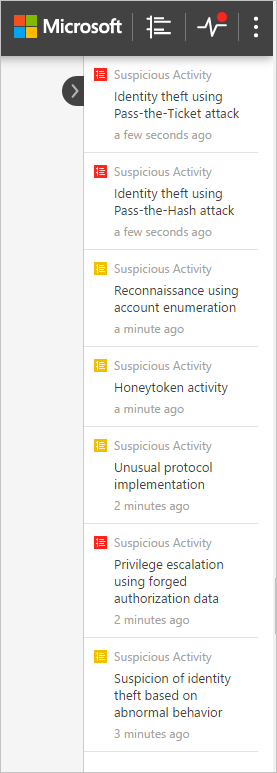
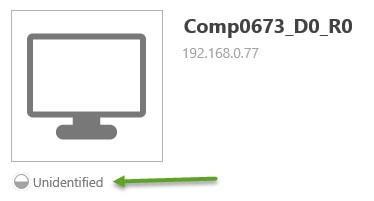

*적용 대상: Advanced Threat Analytics 버전 1.8*

# ATA 콘솔 작업

ATA 콘솔을 사용하여 ATA에서 검색한 의심스러운 활동을 모니터링하고 대응할 수 있습니다.

? 키를 입력하면 ATA 포털 접근성을 위한 바로 가기 키가 제공됩니다. 

## ATA 콘솔에 대한 액세스 설정

ATA 콘솔에 로그인하려면 ATA 콘솔에 액세스할 수 있는 적절한 ATA 역할을 할당한 사용자로 로그인해야 합니다. ATA에서 RBAC(역할 기반 액세스 제어)에 대한 자세한 내용은 [ATA 역할 그룹 작업](ata-role-groups.md)을 참조하세요.

## ATA 콘솔 로그인

1. ATA 센터 서버에서 바탕 화면에 있는 **Microsoft ATA 콘솔** 아이콘을 클릭하거나 브라우저를 열고 ATA 콘솔로 이동합니다.

    

>[!NOTE]
> ATA 센터나 ATA 게이트웨이에서 브라우저를 열고 ATA 센터 설치에서 ATA 콘솔에 대해 구성한 IP 주소로 이동합니다.    

2.  ATA 센터가 설치된 컴퓨터와 ATA 콘솔에 액세스하려는 컴퓨터가 둘 다 도메인에 연결되어 있는 경우 ATA는 Windows 인증과 통합된 Single Sign-On을 지원합니다. 컴퓨터에 이미 로그온되어 있으면 ATA는 해당 토큰을 사용하여 ATA 콘솔에 로그인합니다. 스마트 카드를 사용하여 로그인할 수도 있습니다. ATA의 사용 권한은 [관리자 역할](ata-role-groups.md)과 일치합니다.

> [!NOTE]
> ATA 관리자 사용자 이름 및 암호를 사용하여 ATA 콘솔에 액세스하려는 컴퓨터에 로그온해야 합니다. 또는 다른 사용자로 브라우저를 실행하거나 Windows에서 로그아웃하고 ATA 관리자 사용자로 로그온할 수 있습니다. ATA 콘솔에서 자격 증명을 확인하도록 하려면 IP 주소를 사용하여 콘솔에 액세스합니다. 자격 증명을 입력하라는 메시지가 표시됩니다.

SSO를 사용하여 로그인하려면 브라우저에서 ATA 콘솔 사이트가 로컬 인트라넷 사이트로 정의되어 있는지 확인하고 짧은 이름 또는 localhost를 사용하여 액세스해야 합니다.

> [!NOTE]
> 각 의심스러운 활동 및 상태 경고를 기록할 뿐 아니라 ATA 콘솔에서 변경한 모든 구성이 ATA 센터 컴퓨터의 Windows 이벤트 로그, **응용 프로그램 및 서비스 로그**와 **Microsoft ATA**에서 감사됩니다. ATA 콘솔에 대한 각 로그인도 감사됩니다.    ATA 게이트웨이에 영향을 주는 구성도 ATA 게이트웨이 컴퓨터의 Windows 이벤트 로그에 기록됩니다. 

## ATA 콘솔

ATA 콘솔은 모든 의심스러운 활동에 대한 빠른 보기를 시간순으로 제공합니다. 모든 활동의 세부 정보를 검색하고 해당 활동에 따라 작업을 수행할 수 있습니다. 또한 콘솔에는 ATA 네트워크 또는 의심스러운 것으로 간주되는 새로운 활동에 대한 문제를 강조하는 경고 및 알림도 표시됩니다.

이는 ATA 콘솔의 주요 요소입니다.

### 공격 타임라인

ATA 콘솔에 로그인하면 이 기본 시작 페이지로 이동합니다. 기본적으로 해결되지 않은 모든 의심스러운 활동이 공격 타임라인에 표시됩니다. 모두, 미해결, 해제됨 또는 해결됨 상태의 의심스러운 활동을 표시하도록 공격 타임라인을 필터링할 수 있습니다. 또한 각 활동에 할당된 심각도를 볼 수 있습니다.

자세한 내용은 [의심스러운 활동 작업](working-with-suspicious-activities.md)을 참조하세요.

### 알림 표시줄

새로운 의심스러운 활동이 검색된 경우 오른쪽에 알림 표시줄이 자동으로 열립니다. 마지막으로 로그인한 시간 이후에 새로운 의심스러운 활동이 있는 경우에는 로그인에 성공한 후에 알림 표시줄이 열립니다. 언제든지 오른쪽에 있는 화살표를 클릭하여 알림 표시줄에 액세스할 수 있습니다.

### 필터링 패널

공격 타임라인에 표시되거나 엔터티 프로필 의심스러운 활동 탭에 표시되는 의심스러운 활동을 상태 및 심각도에 따라 필터링할 수 있습니다.

### 검색 창

최상위 메뉴에서 검색 창을 찾을 수 있습니다. ATA에서 특정 사용자, 컴퓨터 또는 그룹을 검색할 수 있습니다. 검색하려면 입력을 시작하기만 하면 됩니다.

### 상태 관리 센터

상태 관리 센터에서는 ATA 배포에서 제대로 작동하지 않는 요소가 있는 경우 경고를 제공합니다.

시스템에서 연결 오류 또는 ATA Gateway 연결 끊김 등의 문제가 발생할 때마다 상태 관리 센터 아이콘에 빨간색 점이 표시됩니다. 

상태 관리 센터 경고는 해제하거나 해결할 수 있으며 심각도에 따라 높음, 중간 또는 낮음으로 분류할 수 있습니다. 해결한 경고를 ATA 서비스에서 여전히 활성 상태인 것으로 검색한 경우 이 경고는 자동으로 미해결 경고 목록으로 이동합니다. 시스템에서 더 이상 경고의 원인이 없는 것으로 검색한 경우(상황이 해결된 경우) 이 경고는 자동으로 해결됨 목록으로 이동합니다.

### 사용자 및 컴퓨터 프로필

ATA에서는 네트워크의 각 사용자 및 컴퓨터에 대한 프로필을 작성합니다. 사용자 프로필에는 ATA가그룹 멤버 자격, 최근 로그인 및 최근에 액세스한 리소스와 같은 일반 정보가 표시합니다. 사용자가 VPN을 통해 연결한 위치 목록도 제공됩니다. ATA에서 중요한 것으로 간주되는 그룹 멤버 자격 목록은 아래를 참조하세요.

컴퓨터 프로필에는 ATA가 최근 로그인 및 최근에 액세스한 리소스와 같은 일반 정보를 표시합니다.

ATA에서는 요약, 활동 및 의심스러운 활동 페이지에서 엔터티(컴퓨터, 장치, 사용자)에 대한 추가 정보를 제공합니다.

ATA에서 완전히 확인할 수 없는 프로필 옆에는 절반이 채워진 원 아이콘이 표시됩니다.

### 중요한 그룹

다음 그룹 목록은 ATA에서 **중요한 그룹**으로 간주됩니다. 다음은 관리자 권한이 있는 그룹으로 플래그가 지정되고 중요한 계정에 해당하는 경고를 생성하는 그룹입니다.

- Enterprise Read Only Domain Controllers 
- Domain Admins 
- 도메인 컨트롤러 
- Schema Admins
- Enterprise Admins 
- Group Policy Creator Owners 
- Read Only Domain Controllers 
- Administrators  
- Power Users  
- Account Operators  
- Server Operators   
- Print Operators
- Backup Operators
- Replicators 
- Remote Desktop Users 
- Network Configuration Operators 
- Incoming Forest Trust Builders 
- DNS Admins 

### 최소 프로필

콘솔의 도처에 사용자 또는 컴퓨터와 같은 단일 엔터티가 표시된 곳이 있습니다. 엔터티 위로 마우스를 가져가면 다음 정보(사용 가능한 경우)가 표시된 최소 프로필이 자동으로 열립니다.

-   Name

-   사진

-   메일

-   전화

-   심각도별 의심스러운 활동 수

## 참고 항목

[ATA 포럼을 확인해 보세요!](https://social.technet.microsoft.com/Forums/security/home?forum=mata)
